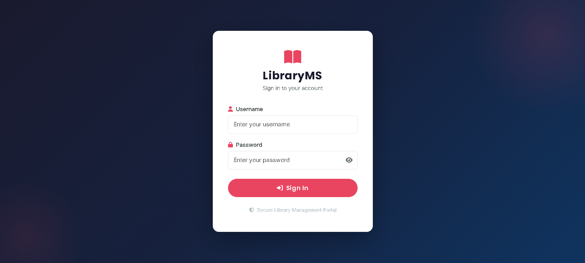
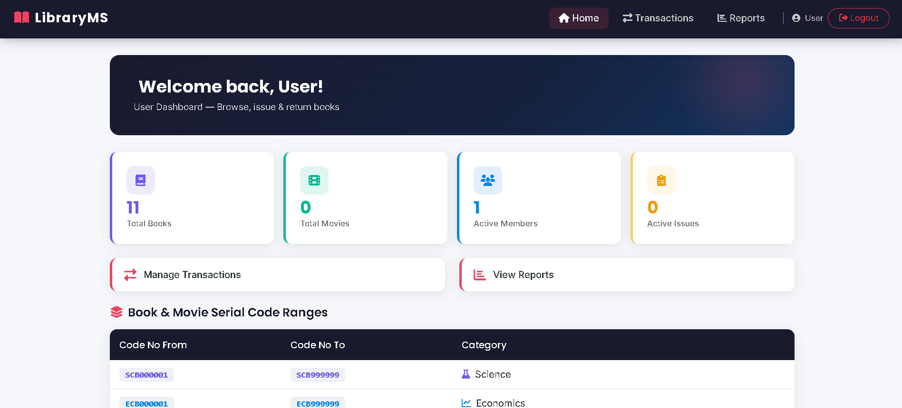
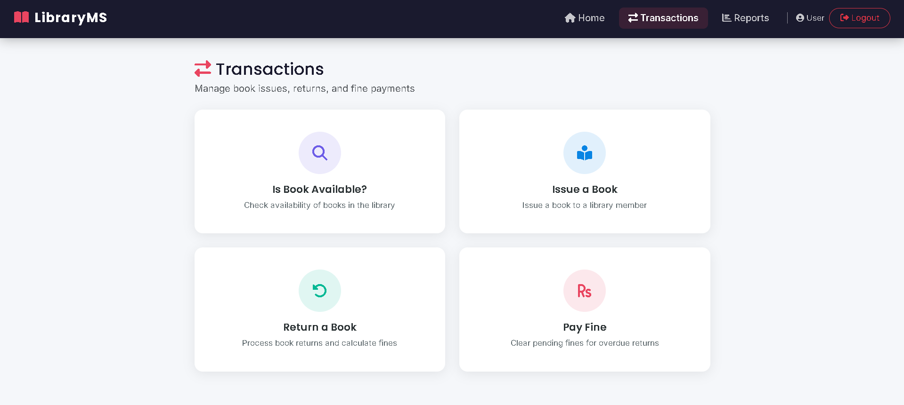

# 📚 Library Management System

This is a simple and fully functional **Library Management System** built using **PHP, MySQL, Bootstrap, and JavaScript**.
The goal of this project was to understand how real-world systems manage books, users, and transactions like issuing and returning.

---

## 🚀 Features

### 🔐 Login System

* Separate login for Admin and User
* Session-based authentication
* Role-based access

### 📚 Library Operations

* Add / update books and movies
* Manage memberships
* Issue and return books
* Fine calculation for overdue returns (₹5/day)

### 📊 Reports

* Master list of books and movies
* Membership records
* Active issued books
* Overdue returns
* Pending requests

### ⚙️ Admin Controls

* Manage books, members, and users
* Full CRUD operations

---

## 🛠 Tech Stack

* PHP (Core PHP)
* MySQL
* Bootstrap 5
* JavaScript

---

## ⚡ How to Run

1. Install XAMPP
2. Move the project folder to:

   ```
   htdocs/library
   ```
3. Start Apache and MySQL
4. Open:

   ```
   http://localhost/library
   ```

👉 The database will be created automatically when you run the project for the first time.

---

## 🔑 Login Details

**Admin**

* Username: `adm`
* Password: `adm`

**User**

* Username: `user`
* Password: `user`

---

## 📂 Project Structure

```
library/
│── index.php
│── conn.php
│── header.php
│── footer.php
│── login.php
│── home.php
│── transactions/
│── reports/
│── maintenance/
```

---

## 📸 Screenshots

### Login Page



### Dashboard



### Transactions



---

## ⚠️ Note

This project is made for learning purposes.
For real-world use, improvements can be done like:

* Using prepared statements
* Better password encryption (bcrypt)

---

## 👨‍💻 Author

Vaibhav Gupta

---

This project helped me understand backend logic, database handling, and how a complete system is structured.
